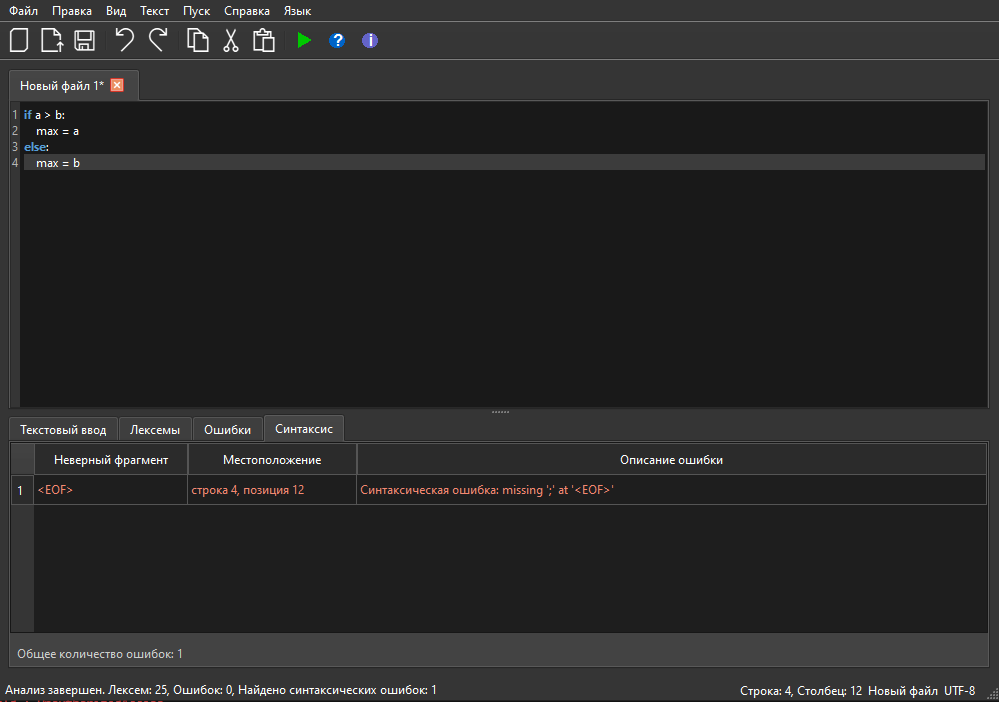
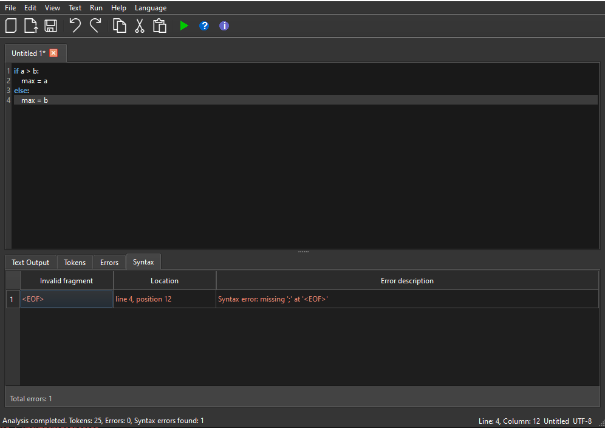

# Курсовая работа: Синтаксический анализатор (парсер) с использованием ANTLR

## 1. Название и цель работы

**Название:** Разработка синтаксического анализатора (парсера) для условного оператора `if-else` с использованием ANTLR

**Цель работы:** Изучить назначение и принципы работы синтаксического анализатора в структуре компилятора. Спроектировать грамматику, построить соответствующую схему метода анализа грамматики и выполнить программную реализацию парсера с нейтрализацией синтаксических ошибок методом Айронса. Интегрировать разработанный модуль в ранее созданный графический интерфейс языкового процессора.

---

## 2. Сведения об авторе

- **Студент:** Александр
- **Группа:** АВТ-314
- **Вариант задания:** 95
- **Дата выполнения:** 2026

---

## 3. Постановка задачи

Разработать синтаксический анализатор (парсер) в соответствии с индивидуальным вариантом курсовой работы, интегрировать его в приложение из лабораторной работы №1 и обеспечить наглядный вывод результатов анализа.

### Требования к разработке парсера:

1. **Разработать грамматику** для заданной синтаксической конструкции (условный оператор `if-else` языка Python)
2. **Построить схему метода анализа** на основе разработанной грамматики
3. **Выполнить программную реализацию** алгоритма работы синтаксического анализа с использованием ANTLR
4. **Реализовать алгоритм нейтрализации** синтаксических ошибок методом Айронса
5. **Обеспечить обработку входных данных** — строка (текст программного кода) из области редактирования
6. **Предусмотреть выходные данные:**
   - При успешном анализе корректной строки — сообщение об отсутствии ошибок
   - При обнаружении ошибок — таблица с описанием каждой ошибки

### Требования к интеграции и интерфейсу:

1. **Встроить парсер** в ранее разработанный интерфейс (ЛР1) и связать его с кнопкой «Пуск»
2. **Окно вывода результатов** должно содержать таблицу ошибок со следующими столбцами:
   - **Неверный фрагмент** — символ или фрагмент, вызвавший ошибку
   - **Местоположение** — номер строки, позиция символа
   - **Описание ошибки** — текстовое описание проблемы
3. **Отображение общего количества** найденных ошибок
4. **Реализовать навигацию по ошибкам** — при щелчке на строке таблицы курсор в области редактирования устанавливается на позицию ошибочного фрагмента

---

## 4. Вариант задания

### 4.1 Текстовое описание

**Вариант 95:** Синтаксический анализ условного оператора `if-else` языка Python с арифметическими выражениями

### 4.2 Перечень допустимых языковых конструкций

1. **Ключевые слова:** `if`, `else`
2. **Идентификаторы:** последовательность букв, цифр и подчеркивания, начинающаяся с буквы или подчеркивания
3. **Целые числа:** последовательность цифр (0-9)
4. **Операторы сравнения:** `>`, `<`, `>=`, `<=`, `==`, `!=`
5. **Арифметические операторы:** `+`, `-`, `*`, `/`, `%`, `//`, `**`
6. **Оператор присваивания:** `=`
7. **Разделители:** `:`, `;`, `(`, `)`, `{`, `}`, `[`, `]`, `,`
8. **Пробелы и символы новой строки** — игнорируются (разделители)

### 4.3 Примеры корректных входных строк

**Пример 1 (простой if-else):**
```python
if a > b:
  max = a;
else:
  max = b;
```

**Пример 2 (with arithmetic expressions):**
```python
if x >= 10:
  result = x * 2 + 5;
else:
  result = x - 1;
```

**Пример 3 (nested if-else):**
```python
if a > 0:
  if b < 10:
    c = a + b;
  else:
    c = a - b;
else:
  c = 0;
```

---

## 5. Разработка грамматики

### 5.1 Определение грамматики (расширенная форма Бэкуса-Наура)

Грамматика определена в файле `grammar/IfElseSubset.g4` (формат ANTLR):

```antlr
grammar IfElseSubset;

options { language=Python3; }

program
    : ifStmt NL* EOF
    ;

ifStmt
    : IF cond COLON suite ELSE COLON suite SEMI
    ;

cond
    : expr relOp expr
    ;

relOp
    : GT | LT | GE | LE | EQ | NE
    ;

expr
    : term ( (PLUS | MINUS) term )*
    ;

term
    : factor ( (STAR | DIV | MOD | IDIV) factor )*
    ;

factor
    : INT
    | ID
    | LPAREN expr RPAREN
    ;

suite
    : NL* stmt NL*
    ;

stmt
    : ID ASSIGN expr SEMI
    ;

// Terminals
IF      : 'if' ;
ELSE    : 'else' ;

GE      : '>=' ;
LE      : '<=' ;
EQ      : '==' ;
NE      : '!=' ;
IDIV    : '//' ;

GT      : '>' ;
LT      : '<' ;

ASSIGN  : '=' ;
PLUS    : '+' ;
MINUS   : '-' ;
STAR    : '*' ;
DIV     : '/' ;
MOD     : '%' ;

SEMI    : ';' ;
COLON   : ':' ;
LPAREN  : '(' ;
RPAREN  : ')' ;

INT     : [0-9]+ ;

ID      : [a-zA-Z_] [a-zA-Z0-9_]* ;

NL      : '\r'? '\n' ;

WS      : [ \t]+ -> skip ;

COMMENT : '#' ~[\r\n]* -> skip ;
```

### 5.2 Описание правил грамматики

- **program** → корневое правило, программа состоит из оператора if-else
- **ifStmt** → структура if-else: `if условие : блок else : блок ;`
- **cond** → условие: два выражения, разделенные оператором сравнения
- **relOp** → оператор сравнения: `>`, `<`, `>=`, `<=`, `==`, `!=`
- **expr** → арифметическое выражение: сумма/разность термов
- **term** → терм выражения: произведение/деление факторов
- **factor** → базовый элемент: число, переменная или выражение в скобках
- **suite** → блок кода: одно или несколько присваиваний
- **stmt** → простой оператор: присваивание переменной

---

## 6. Классификация грамматики

### 6.1 По иерархии Хомского

**Тип:** Контекстно-свободная грамматика (КСГ) — **Грамматика типа 2**

**Обоснование:** 
- Левая часть каждого параграфа состоит из ровно одного нетерминала
- Правая часть может быть любой последовательностью терминалов и нетерминалов
- Не содержит контекстных зависимостей

### 6.2 По другим критериям

- **Детерминированная:** Да (LALR(1))
- **Однозначная:** Да (без неоднозначностей)
- **Полная:** Да (охватывает все необходимые конструкции)
- **Использование ANTLR:** Позволяет автоматически генерировать лексер и парсер

---

## 7. Метод анализа

### 7.1 Выбранный метод: Рекурсивный спуск (через ANTLR)

**Основание выбора:**
- Простота реализации и понимания
- Хорошая локализация ошибок
- Удобство интеграции методов нейтрализации ошибок
- ANTLR автоматически генерирует лексер и парсер на основе грамматики

### 7.2 Алгоритм синтаксического анализа

```
Функция parseProgram():
1. Вызвать parseIfStmt()
2. Проверить, что достигнут конец файла (EOF)
3. Если ошибок нет → возвратить успех
4. Иначе → возвратить список ошибок

Функция parseIfStmt():
1. Ожидать токен IF
2. Вызвать parseCondition()
3. Ожидать токен COLON (:)
4. Вызвать parseBlock()
5. Ожидать токен ELSE
6. Ожидать токен COLON (:)
7. Вызвать parseBlock()
8. Ожидать токен SEMI (;)

Функция parseExpression():
1. Вызвать parseTerm()
2. Пока текущий токен ∈ {PLUS, MINUS}:
   а. Прочитать оператор
   б. Вызвать parseTerm()

Функция parseBlock():
1. Вызвать parseStatement()
2. Пока текущий токен — начало оператора:
   а. Вызвать parseStatement()
```

### 7.3 Граф переходов (упрощенный)

```
START → IF → Condition → COLON → Block → ELSE → COLON → Block → SEMI → END
  ↓                ↓                   ↓
ERROR           ERROR              ERROR
```

### 7.4 Реализация

**Файлы реализации:**
- `grammar/IfElseSubset.g4` — определение грамматики ANTLR
- `antlr_integration.py` — интеграция ANTLR с приложением






- `tools/generate_antlr.bat` — скрипт для генерации лексера и парсера

---

## 8. Диагностика и нейтрализация синтаксических ошибок

### 8.1 Метод нейтрализации ошибок: Метод Айронса

**Принцип работы:**
При обнаружении синтаксической ошибки парсер:
1. Регистрирует ошибку с информацией о позиции и тип ошибки
2. Пропускает ошибочный токен
3. Продолжает анализ до ближайшего **синхронизирующего токена**
4. Возобновляет анализ с синхронизирующего токена

**Синхронизирующие токены:**
- Ключевые слова: `if`, `else`
- Разделители: `;` (точка с запятой)
- Конец файла (EOF)

### 8.2 Обработка ошибок в приложении

**Класс `SyntaxErrorRecord` (parser.py):**
```python
@dataclass
class SyntaxErrorRecord:
    fragment: str      # Неверный фрагмент
    line: int          # Номер строки
    col: int           # Позиция символа
    message: str       # Описание ошибки
    
    def location_ru(self) -> str:
        return f"строка {self.line}, позиция {self.col}"
    
    def location_en(self) -> str:
        return f"line {self.line}, position {self.col}"
```

**Класс `_CollectingErrorListener` (antlr_integration.py):**
- Собирает все ошибки в процессе анализа
- Поддерживает локализацию (русский/английский)
- Форматирует сообщения об ошибках

### 8.3 Примеры ошибок и их обработка

| Неверный фрагмент | Местоположение | Описание |
|---|---|---|
| `.` | строка 1, позиция 9 | Ожидалась цифра перед десятичной точкой |
| `else` (без if) | строка 2, позиция 1 | Ожидалась конструкция if перед else |
| `:` (пропущено) | строка 1, позиция 8 | Ожидалось двоеточие после условия |
| `;` (пропущено) | строка 4, позиция 15 | Ожидалась точка с запятой в конце |

---

## 9. Тестовые примеры

### 9.1 Тест 1: Корректный код (без ошибок)

**Входные данные:**
```python
if a > b:
  max = a
else:
  max = b;
```

**Ожидаемый результат:**
- ✅ Синтаксических ошибок не обнаружено
- Статус: **SUCCESS**

### 9.2 Тест 2: Ошибка — пропущено двоеточие

**Входные данные:**
```python
if a > b
  max = a
else:
  max = b;
```

**Ожидаемый результат:**
- ❌ Найдена 1 синтаксическая ошибка

| Неверный фрагмент | Местоположение | Описание |
|---|---|---|
| `a` | строка 2, позиция 3 | Ожидалось двоеточие (`:`) после условия |

### 9.3 Тест 3: Ошибка — пропущена точка с запятой в конце

**Входные данные:**
```python
if x >= 10:
  result = x * 2
else:
  result = 0
```

**Ожидаемый результат:**
- ❌ Найдена 1 синтаксическая ошибка

| Неверный фрагмент | Местоположение | Описание |
|---|---|---|
| `EOF` | строка 4, позиция 15 | Ожидалась точка с запятой (`;`) в конце последовательности |

### 9.4 Тест 4: Множественные ошибки

**Входные данные:**
```python
if a > b
  max = a
else
  max = b
```

**Ожидаемый результат:**
- ❌ Найдены 3 синтаксические ошибки

| Неверный фрагмент | Местоположение | Описание |
|---|---|---|
| `a` | строка 2, позиция 3 | Ожидалось двоеточие (`:`) |
| `b` | строка 3, позиция 1 | Ожидалось двоеточие (`:`) |
| `EOF` | строка 4, позиция 15 | Ожидалась точка с запятой (`;`) |

---

## 10. Архитектура приложения

### 10.1 Структура файлов проекта

```
compi_1/
├── main.py                 # Точка входа приложения
├── main_window.py          # Главное окно PyQt6
├── editor_tab.py           # Вкладка редактора
├── result_tabs.py          # Вкладки результатов
├── scanner.py              # Лексический анализатор
├── parser.py               # Структуры синтаксического анализа
├── antlr_integration.py    # Интеграция ANTLR
├── translator.py           # Поддержка локализации
├── requirements.txt        # Зависимости проекта
├── README.md               # Данный файл
├── grammar/
│   └── IfElseSubset.g4     # Грамматика ANTLR
├── antlr_generated/        # Автоматически сгенерированные файлы ANTLR
│   ├── IfElseSubsetLexer.py
│   ├── IfElseSubsetParser.py
│   ├── IfElseSubsetListener.py
│   ├── IfElseSubsetVisitor.py
│   └── (другие вспомогательные файлы)
├── tools/
│   └── generate_antlr.bat  # Скрипт для генерации парсера
└── output/                 # Построенные артефакты
```

### 10.2 Интегрированная обработка анализа

1. **Лексический анализ** (`scanner.py`) → токены
2. **Синтаксический анализ** (`antlr_integration.py` + ANTLR) → ошибки
3. **Отображение результатов** (`main_window.py` → `result_tabs.py`)

---

**Документация создана:** 2026
**Язык программирования:** Python 3.9+
**Фреймворк UI:** PyQt6
**Генератор парсера:** ANTLR 4.13.2
